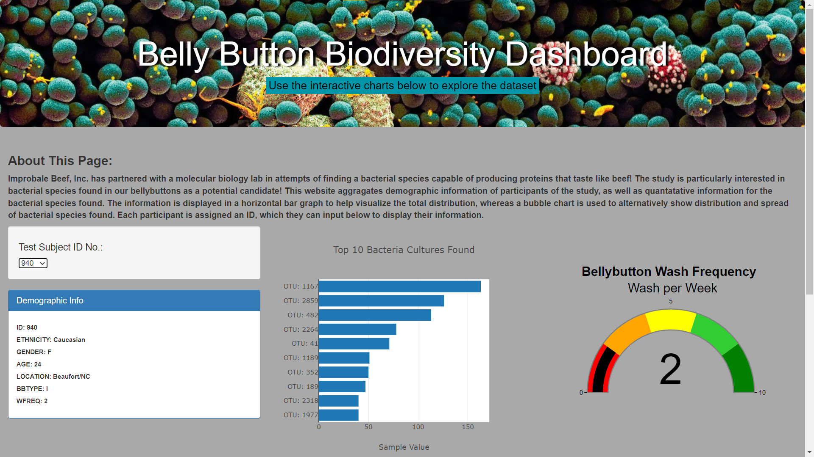
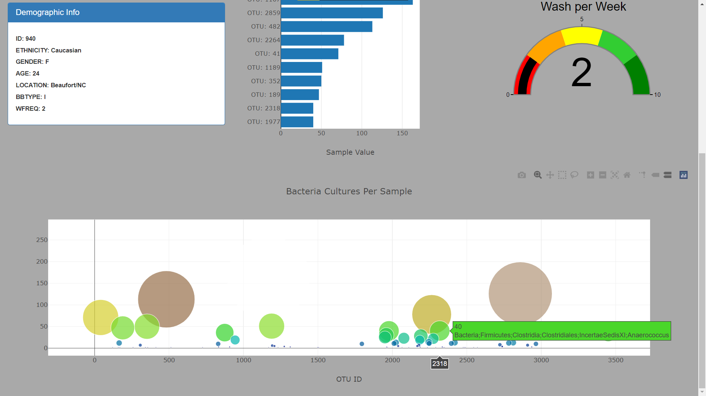

# Bellybutton_Diversity

## Overview:

We are creating a website to display demographic info and results of a study that investigates the navel bacteria in participants, in search for a bacterial species that can produce proteins that taste like beef! 

### Resources:

#### Data was provided in:

- [samples.json](static/js/samples.json)

#### Additional Resources: 

- Bootstrap 3.3.7
- JavaScript 
- HTML
- Plotly 
- d3 (For parsing JSON data)

#### Additional Documentation:

- [Bootstrap](https://getbootstrap.com/docs/4.0/getting-started/introduction/)
- [JavaScritWebDocs](https://developer.mozilla.org/en-US/docs/Web/JavaScript)
- [Plotly](https://plotly.com/javascript/)
- [d3Documentation](https://www.tutorialsteacher.com/d3js/loading-data-from-file-in-d3js#d3.json)

### Results

[Access website here](https://efrenbernal90.github.io/Bellybutton_Diversity)

#### Create the buildChart function

The user begins by selecting their number from the dropdown menu. 
      
    <select id="selDataset" onchange="optionChanged(this.value)"></select>
    
The function below is tied to the user select option from the dropdown menu:

    // Create the buildCharts function.
    function buildCharts(sample) {
      // Use d3.json to load and retrieve the samples.json file 
      d3.json("static/js/samples.json").then((data) => {
        
        // Create a variable that filters the metadata array for the object with the desired sample number.
        var metadataArray = data.metadata.filter(foo => foo.id ==sample);
        
        // Create a variable that holds the samples array. 
        let samplesArray = data.samples;
        
        // Create a variable that holds the first sample in the metadata array.
        var metadataSample = metadataArray[0]; 

        // Create a variable that filters the samples for the object with the desired sample number.
        let samples = samplesArray.filter(element => element.id == sample);
        
        // Create a variable that holds the first sample in the array.
        let currentSample = samples[0];
        
        // Create variables that hold the otu_ids, otu_labels, and sample_values.
        let otuIDs = currentSample.otu_ids;
        let otuLabels = currentSample.otu_labels.slice(0,10).reverse();
        let sampleValues = currentSample.sample_values.slice(0,10).reverse(); 
         
        // Create a variable that holds the washing frequency.
        let wFreq = metadataSample.wfreq;
        let bubbleLabels = currentSample.otu_labels;
        let bubbleValues = currentSample.sample_values;

        // Create the yticks for the bar chart.
        // Hint: Get the the top 10 otu_ids and map them in descending order  
        //  so the otu_ids with the most bacteria are last. 
        
        var yticks = otuIDs.map(foo => "OTU: " + foo).slice(0,10).reverse();

        // console.log(yticks);

#### Create the Plotly data and layout objects

Using Plotly, you can create objects to contain the data and the layout of desired charts and add to the code above:

    // Create the trace for the bar chart. 
        var barData = [{
              x: sampleValues,
              y: yticks ,
              type: "bar",
              orientation: "h",
              text: otuLabels
        }];
        
        // Create the layout for the bar chart. 
        var barLayout = {
            title: "Top 10 Bacteria Cultures Found",
            xaxis: {title: "Sample Value"},
            automargin: true,
            paper_bgcolor: "darkgrey",
        };
        
        // Use Plotly to plot the data with the layout. 
        Plotly.newPlot("bar",barData,barLayout);

        // Create the trace for the bubble chart.
        var bubbleData = [{
          x: otuIDs,
          y: bubbleValues,
          text: bubbleLabels,
          mode: 'markers',
          colorscale: 'Electric',
          marker: {
            color: bubbleValues,
            size: bubbleValues,
            colorscale: 'Earth'
          }
        }];

        // Create the layout for the bubble chart.
        var bubbleLayout = {
          title: "Bacteria Cultures Per Sample",
          xaxis: {title: "OTU ID"}, 
          paper_bgcolor: "darkgrey",
          automargin: true
        };

        // Use Plotly to plot the data with the layout.
        Plotly.newPlot("bubble", bubbleData, bubbleLayout); 

        // Create the trace for the gauge chart.
        var gaugeData = [{
          type: "indicator",
          mode: "gauge+number",
          value: wFreq,
          title: { text: "<b> Bellybutton Wash Frequency </b>   Wash per Week", font: { size: 24}
          },
          gauge: {
            axis: { range: [0, 10], tickwidth: 1, tickcolor: "black" },
            bar: { color: "black" },
            bgcolor: "white",
            borderwidth: 2,
            bordercolor: "gray",
            steps: [
              { range: [0, 2], color: "red" },
              { range: [2, 4], color: "orange" },
              { range: [4, 6], color: "yellow" },
              { range: [6, 8], color: "limegreen" },
              { range: [8, 10], color: "green" },
            ]
          }
        }];

        // Create the layout for the gauge chart.
        var gaugeLayout = { 
          automargin: true,
          paper_bgcolor: "darkgrey",
          font: { color: "black", family: "Arial" }
        };

        // Use Plotly to plot the gauge data and layout.
        Plotly.newPlot('gauge', gaugeData,gaugeLayout);
      });
    }

#### How the website works:

1. Select your 'Test Subject ID Number' from the dropdown menu:

2. Once an ID has been selected, demographic info is displayed alongside a distribution chart of the top 10 (if present) bacterial species, and a bubble chart to help visualize the total size of bacterial species present in sample. The gauge on the right side displays bellybutton wash frequency, per week. 

